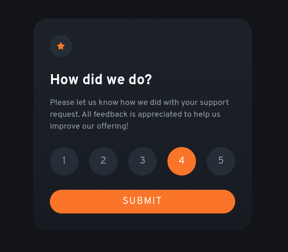

# Frontend Mentor - Interactive rating component solution

This is a solution to the [Interactive rating component challenge on Frontend Mentor](https://www.frontendmentor.io/challenges/interactive-rating-component-koxpeBUmI). Frontend Mentor challenges help you improve your coding skills by building realistic projects.

## Table of contents

- [Overview](#overview)
  - [The challenge](#the-challenge)
  - [Screenshot](#screenshot)
  - [Links](#links)
- [My process](#my-process)
  - [Built with](#built-with)
  - [What I learned](#what-i-learned)
  - [Continued development](#continued-development)
  - [Useful resources](#useful-resources)
- [Author](#author)

**Note: Delete this note and update the table of contents based on what sections you keep.**

## Overview

Rating component for Frontend Mentor with Tailwind CSS

### The challenge

Users should be able to:

- View the optimal layout for the app depending on their device's screen size
- See hover states for all interactive elements on the page
- Select and submit a number rating
- See the "Thank you" card state after submitting a rating

### Screenshot

### Links

- Solution URL: [Here](https://github.com/Nicolas-Orozco/frontend-mentor-rating)
- Live Site URL: [Here](https://frontend-mentor-rating.vercel.app/)

## My process

This repo :)

### Built with

- Semantic HTML5 markup
- CSS custom properties
- Flexbox
- Mobile-first workflow
- [Tailwind CSS](https://tailwindcss.com/) - For styles

### What I learned

- How to use, hide and style radio inputs
- Tailwind Breakpoints
- Peer, after and other pseudo elements, classes
- Pass, receive and query data from url

### Continued development

Use darkened versions of theme colors without explictly declaring them.
Improve and make responsive sizes for images.

### Useful resources

- [Tailwind Docs](https://tailwindcss.com/docs/installation) - I think this is obvious.
- [Write text inside Radio Buttons](https://codepen.io/w3programmings/pen/zzRKpy) - This example helped me a lot when heavy styling radio inputs.

## Author

- Github - [Nicolas Orozco ](https://github.com/Nicolas-Orozco)
- Frontend Mentor - [@Nicolas-Orozco](https://www.frontendmentor.io/profile/Nicolas-Orozco)

**Thanks for reading!!**
